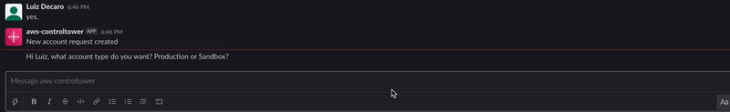

# Multi-Environment Chatops Bot for AWS Control Tower

Build a fully Serverless ChatOps bot powered by AI (Amazon Lex) through a multi-environment CICD pipeline that integrates with AWS Control Tower Account Factory. Build an easy frontend integration with your favorite request portal or channel (Slack, Chime or Website) to offer AWS Account vending at scale for your customers.

# Table of Contents
1. [Introduction](#introduction)
2. [Background](#background)
3. [Architecture Overview](#Architecture-Overview
)
4. [Walkthrough](#walkthrough)
5. [Slack Integration](#Slack-Integration-Example)

## Introduction

Most of the AWS Control Tower customers use the AWS Control Tower Account Factory (a Service Catalog product), and the ServiceCatalog service to vend standardized AWS Services and Products  into AWS Accounts.
ChatOps is a collaboration model that connects a process with people, tools and automation together. It is a combination of a Bot that can be fulfilling service requests (the work needed) and can be augmented by Ops and Engineering staff to allow approval processes or corrections in case of exception requests. Major tasks in public Cloud go towards building a proper foundation (the so called LandingZone). Main goals of this foundation are to provide an AWS Account access (with the right permissions), but also the right CCoE approved products and services.
This post shows how you can use the existing AWS Control Tower Account Factory, extending the Service Catalog portfolio in Control Tower with additional products, and executing Account vending and Product vending through an easy ChatBot interface. We will show you how to use this Solution with Slack, but it can be easily used to work with Chime / MS Teams or a normal Web-frontend as the integration is channel-agnostig through an API Gateway integration layer.
In this blog post we will show how to combine all of this, integrating a ChatBot frontend where users can issue requests against the CCoE and Ops team to get AWS services fulfilled in an easy and transparent way. As a result, you experience a more efficient process for vending AWS Accounts and Products and taking away the burden for your Cloud Operations team.

## Background

* An [AWS Account Factory Account](https://docs.aws.amazon.com/controltower/latest/userguide/account-factory.html) account is an AWS account provisioned using account factory in AWS Control Tower.
* [AWS Service Catalog](https://aws.amazon.com/servicecatalog) allows you to centrally manage commonly deployed IT services. In the context of this blog, account factory uses AWS Service Catalog to provision new AWS accounts.
* [AWS Cloud9](https://aws.amazon.com/cloud9/)  is a cloud-based integrated development environment (IDE) that lets you write, run, and debug your code with just a browser.
* A [Control Tower provisioned product](http://docs.aws.amazon.com/servicecatalog/latest/adminguide/what-is_concepts.html#what-is_concepts-provprod) is an instance of the Control Tower Account Factory product that is provisioned by AWS Service Catalog. In this post, any new AWS account created through the ChatOps solution will be a provisioned product and visible in Service Catalog.

## Prerequisites

For this walkthrough, you should have the following prerequisites ready.
What you’ll need:
* An [AWS account](https://signin.aws.amazon.com/signin?redirect_uri=https%3A%2F%2Fportal.aws.amazon.com%2Fbilling%2Fsignup%2Fresume&client_id=signup)
* A ready [AWS ControlTower deployment](https://docs.aws.amazon.com/controltower/latest/userguide/getting-started-with-control-tower.html) (needs 3 AWS Accounts)
* AWS Cloud9 IDE with access to download/clone the scripts provided through Github
* You need to log into the AWS Control Tower master account with AWSAdministratorAccess role if using AWS SSO or equivalent permissions if you are using other federations.


## Architecture Overview
### How it works

The following architecture shows the overview of the solution which will be built with the code provided through Github. 


<p align="center">Figure 1 - Architecture Overview</p>

### AWS Architecture Overview

You will start with building these 2 main components of the Architecture through an automated script, this will be split into "STEP 1", and "STEP 2" in this walkthrough.

- STEP 1) "ChatOps AWS Account Vending": The key part of the left side of the Architecture, the Amazon Lex Bot called ("ChatOps" bot) will be built in a first step, then

- STEP 2) "DevOps AWS Account Vending": Build and deploy a full load testing DevOps pipeline that will stresstest the Lex bot and its capabilities to answer to requests. This will build the supporting components that are needed to integrate with Amazon Lex and are described below (API Gateway, Lambda, DynamoDB, SNS). 

- STEP 3) "Testing your ChatOps Bot": We will execute some test scripts through Postman, that will trigger Amazon API Gateway and trigger a sample Account request that will require a feedback from the ChatOps Lex Bot.

- STEP 4) "Integration with Slack": The final step is an end-to-end integration with an communication platform solution such as Slack.

<p>The DevOps pipeline (using CodePipeline, CodeCommit, CodeBuild and CodeDeploy) is automatically triggered when the stack is deployed and the AWS CodeCommit repository is created inside the account. The pipeline builds the Amazon Lex ChatOps bot from the source code. The Step 2 integrates the surrounding components with the ChatOps Lex bot in 3 different environments: Dev/Staging/Prod. In addition to that, we use canary deployment to promote updates in the lambda code from the AWS CodeCommit repository hosting the API. To implement the rollback procedure, a log metric filter will scan the word Exception inside the log file in CloudWatch. When the word is found, an alarm is triggered and deployment is automatically rolled back. Usually, the automatic rollback will occur automatically during the load test phase, when locust is testing the lex-box api. This would prevent faulty code from being promoted into the production environment.</p>


The main components of this solution are:

* Amazon Lex: With Amazon Lex, the same deep learning technologies that power Amazon Alexa are now available to any developer, enabling you to quickly and easily build sophisticated, natural language, conversational bots (“chatbots”). As Amazon lex is not available yet in all AWS regions that currently AWS Control Tower is supported, it may be that you want to deploy Amazon Lex in another region than you have AWS Control Tower deployed.
*	API Gateway / Lambda: The API Gateway is used as a central entry point for the Lambda functions (AccountVendor) that are capturing the Account vending requests from a frontend (e.g. Slack or Website). As Lambda functions can not be exposed directly as a REST service, they need a trigger which in this case API Gateway does.
*	SNS: Amazon Simple Notification Service (Amazon SNS) is a fully managed messaging service. SNS is used to send notifications via e-mail channel to an approver mailbox.
*	DynamoDB: Amazon DynamoDB is a key-value and document database that delivers single-digit millisecond performance at any scale. It's a fully managed, multi-region, multi-active, durable database. DynamoDB will store the Account vending requests from the Lambda code that get triggered by the Lex-bot interaction.
*	Parameter Store: 
*	Code Commit: There are two major repositories used, one repository where Amazon Lex bot is created through a Java-Lambda function and installed in Phase 1. And one for the Amazon Lex bot APIs that are running and capturing the Account vending requests behind API Gateway and then communicating with the Amazon Lex Bot. 
*	Code Pipeline: It integrates CodeCommit, and the different build stages implemented in the diagram. 
*	Code Build: Each different activity executed inside the pipeline is a CodeBuild activity. Inside the source code repository there are different files with the prefix buildspec-. Each of these files contains the exact commands that the code build must execute on each of the stages: build/test 
*	Code Deploy: this is an AWS service that manages the deployment of the serverless application stack. In this solution it implementes a canary deployment where in the first minute we switch 10% of the requests to the new version of it. ([CodeDeployDefaultLambdaCanary10Percent5Minutes](https://docs.aws.amazon.com/codedeploy/latest/userguide/deployment-configurations.html#deployment-configuration-lambda))


## Walkthrough
To get started, you can either use Cloud9 IDE or log-into your AWS SSO environment within AWS Control Tower. For simplicity, we will follow the steps assuming you run this installation with your local machine using AWS SSO.

### 1. Prepare: Set up the sample solution
Log in to your AWS account through AWS SSO if you haven’t done so already. Go to your AWS Management Account and configure your AWS CLI with your latest credentials through "AWS configure".

1.1. Clone the GitHub repository to your local machine or your Cloud9 environment.

```
git clone ...
```

### 2. STEP 1: Install Amazon Lex Bot

Amazon Lex is currently not deployable navitevly with Amazon CloudFormation, hence the solution is using a custom Lambda resource in CloudFormation to create the Amazon Lex bot. We will create the Lex bot, along some sample utterances, 3 custom slots (Account Type, Account E-Mail and Organizational OU) and one main intent ("Control Tower Account Vending Intent") to capture the request to trigger an AWS Account vending process . For more documentation and background on Amazon Lex, see the [Amazon Lex documentation guide](https://docs.aws.amazon.com/lex/index.html). 

```
./deploy.sh 
```
2.1.	Select a project name, you can override it if you wan’t to choose a custom name and select the bucket name accordingly (we recommend to use the default names)

```
Choose a project name [chatops-lex-bot-xyz]: 
Choose a bucket name for source code upload [chatops-lex-bot-xyz]: 
```
2.2. To confirm, double check the AWS region you have specificed. 
```
Attention:  Make sure you have configured your AWS CLI region! (use either 'aws configure' or set your 'AWS_DEFAULT_REGION' variable). 

Using region from $AWS_DEFAULT_REGION: eu-west-1
```
2.3. Then, make sure you choose the region where you want to install Amazon Lex (make sure you use an available [AWS region where Lex is available](https://docs.aws.amazon.com/lex/latest/dg/supported-regions.html)), or use the default and leave empty.

```
Choose a region where you want to install the chatops-lex-bot [eu-west-1]: 
Using region eu-west-1
```

2.4. The script will create a new S3 bucket in the specified region to upload the code to create the Amazon Lex bot.

```
Creating a new S3 bucket on eu-west-1 for your convenience...
make_bucket: chatops-lex-bot-xyz
Bucket chatops-lex-bot-xyz successfully created!
```
2.5. We show a summary of the bucket name and the project being used.
```
Using project name................chatops-lex-bot-xyz
Using bucket name.................chatops-lex-bot-xyz
```

2.6 Make sure, that if any of these names or outputs are wrong, you can still stop here by pressing Ctrl+c.
```
If these parameters are wrong press ctrl+c to stop now...
```

2.7 The script will upload the source code to the S3 bucket specified, you should see a successful upload.

```
Waiting 9 seconds before continuing
upload: ./chatops-lex-bot-xyz.zip to s3://chatops-lex-bot-xyz/chatops-lex-bot-xyz.zip
```

2.8 Then the script will trigger an [aws cloudformation package](https://docs.aws.amazon.com/cli/latest/reference/cloudformation/package.html) command, that will use the uploaded zip file, reference it and generate a ready CloudFormation yml file for deployment. The output of the generated package-file (devops-packaged.yml) will be stored locally and used to executed the [aws cloudformation deploy](https://docs.aws.amazon.com/cli/latest/reference/cloudformation/deploy/)  command.

```
Successfully packaged artifacts and wrote output template to file devops-packaged.yml.
```

*Note: You can ignore this part as the shell script will execute the "aws cloudformation deploy" command for you.*

```
Execute the following command to deploy the packaged template

aws cloudformation deploy --template-file devops-packaged.yml --stack-name <YOUR STACK NAME>
```


2.9 The AWS CloudFormation scripts should be running in the background
```
Waiting for changeset to be created..
Waiting for stack create/update to complete
Successfully created/updated stack - chatops-lex-bot-xyz-cicd
```
2.10 Once you see the successful output of the CloudFormation script "chatops-lex-bot-xyz-cicd", this means that everything is ready to continue.
```
------------------------------------------
ChatOps Lex Bot Pipeline is installed
Will install the ChatOps API as an Add-On to the Vending Machine
------------------------------------------
```

2.11 Before we continue, confirm the output of the AWS CloudFormation called "chatops-lex-bot-xyz-cicd". You should find 3 Outputs from the CloudFormation template. 

- A CodePipeline, CodeCommit Repository with the same naming convention (chatops-lex-bot-xyz), and a CodeBuild execution with one stage (Prod). The execution of this pipeline should show as "Succeeded" within CodePipeline.
- As a successful result of the execution of the Pipeline, you should find another CloudFormation that was triggered, which you should find in the output of CodeBuild or the CloudFormation Console (chatops-lex-bot-xyz-Prod). 
- The created resource of this CloudFormation will be the Lambda function (chatops-lex-bot-xyz-Prod-AppFunction-abcdefgh) that will create the Amazon Lex Bot. You can find the details in [Amazon Lambda](https://eu-west-1.console.aws.amazon.com/lambda/home?region=eu-west-1#/functions/) in the Mgmt console. For more information on CloudFormation and custom resources, see the [CloudFormation documentation](https://docs.aws.amazon.com/AWSCloudFormation/latest/UserGuide/template-custom-resources-lambda.html).
- You can find the successful execution in the [CloudWatch Logs](https://eu-west-1.console.aws.amazon.com/cloudwatch/home?region=eu-west-1#logsV2:log-groups):
```
Adding Slot Type:: AccountTypeValues
Adding Slot Type:: AccountOUValues
Adding Intent:: AWSAccountVending
Adding LexBot:: ChatOps
Adding LexBot Alias:: AWSAccountVending
```

- Check if the Amazon Lex bot has been created in the [Amazon Lex console](https://eu-west-1.console.aws.amazon.com/lex/), you should see an Amazon Lex bot called "ChatOps" with the status "READY".

2.12. This means you have successfully installed the ChatOps Lex Bot. You can now continue with PHASE2.


### 3. STEP 2. Build of the full CI/CD pipeline (deploy the complete Architecture and test Amazon Lex)

In this section, we will finalize the set up by creating a full CI/CD Pipeline, the API Gateway and Lambda functions that can capture requests for Account creation (AccountVendor) and interact with Amazon Lex, and a full testing through Locust to do a Dev-Staging-Production build pipeline that does a stress test on the whole set of Infrastructure created.

3.1 You should see the same name of the bucket and project as used previously, if not, please override the input here otherwise leave empty (we recommend to use the default names).


```
Choose a bucket name for source code upload [chatops-lex-xyz]: 
```
3.2. This means that the Amazon Lex Bot was successfully deployed and we just confirm the deployed AWS region.
```
ChatOps-Lex-Bot is already deployed in region eu-west-1
```
3.3 Please specify a mailbox that you have access in order to approve new ChatOps (e.g. Account vending) vending requests as a manual approver step.
```
Choose a mailbox to receive approval e-mails for new accounts: mail+chatops-lex-bot-xyz@yourdomain.com
```
3.4 Make sure you have the right AWS region where AWS Control Tower has deployed its Account Factory Portfolio product in Service Catalog (to double check you can log into AWS Service Catalog and confirm that you see the [AWS Control Tower Account Factory](https://eu-west-1.console.aws.amazon.com/servicecatalog/home?region=eu-west-1#admin-products))
```
Choose the AWS region where your vending machine is installed [eu-west-1]: 
Using region eu-west-1
Creating a new S3 bucket on eu-west-1 for your convenience...
{
    "Location": "http://chatops-lex-xyz.s3.amazonaws.com/"
}

Bucket chatops-lex-xyz successfully created!
```
3.5 Now the script will identify if you have Control Tower deployed and if it can identify the Control Tower Account Factory Product.

```
Trying to find the AWS Control Tower Account Factory Portfolio
```
```
Using project name....................chatops-lex-xyz
Using bucket name.....................chatops-lex-xyz
Using mailbox for approvals...........approvermail+chatops-lex-bot-xyz@yourdomain.com
Using lexbot region...................eu-west-1
Using service catalog portfolio-id....port-abcdefghijklm
```
```
If these parameters are wrong press ctrl+c to stop now...

```

3.6	If something is wrong or has not been set and you see an empty line for any of the, stop here and press ctr+c. Check the Q&A section if you might have missed some errors previously. These values need to be filled to proceed.

```
Waiting 1 seconds before continuing
[INFO] Scanning for projects...
[INFO] Building Serverless Jersey API 1.0-SNAPSHOT
```

3.7 You should see a "BUILD SUCCESS" message.

```
[INFO] BUILD SUCCESS
[INFO] Total time:  0.190 s
```

3.8 Then the package built locally will be uploaded to the S3 bucket, and then again prepared for Amazon CloudFormation to package- and deploy.

```
upload: ./chatops-lex-xyz.zip to s3://chatops-lex-xyz/chatops-lex-xyz.zip

Successfully packaged artifacts and wrote output template to file devops-packaged.yml.
Execute the following command to deploy the packaged template
aws cloudformation deploy --template-file devops-packaged.yml --stack-name <YOUR STACK NAME>
```

3.9 You can neglect the above message, as the shell script will execute the Cloudformation API for you. The AWS CloudFormation scripts should be running in the background and you can double check in the AWS Mgmt Console.

```
Waiting for changeset to be created..
Waiting for stack create/update to complete
```

```
Successfully created/updated stack - chatops-lex-xyz-cicd
------------------------------------------
ChatOps Lex Pipeline and Chatops Lex Bot Pipelines successfully installed
------------------------------------------
```

3.10 This means that the Cloud Formation scripts have executed successfully. Lets confirm in the Amazon CloudFormation console, and in Code Pipeline if we have a successful outcome and full test-run of the CICD pipeline. To remember, have a look at the [AWS Architecture overview](##Architecture-overview) and the resources / components created.

You should find the successful Cloud Formation artefacts named:

- chatops-lex-xyz-cicd: This is the core CloudFormation that we created and uploaded that built a full CI-CD pipeline with 3 phases (DEV-STAGING-PROD). All the 3 stages will create a similar set of AWS resources (e.g. API Gateway, Lambda, DynamoDB), but only the Staging phase will run an additional Load-Test prior to doing the production release.

- chatops-lex-xyz-DEV: A successful build, creation and deployment of the DEV environment.
- chatops-lex-xyz-STAGING: The staging phase will run a set of load tests, for a full testing and through [Locust.io](https://locust.io/) (an open-source load testing framework) 
- chatops-lex-xyz-PROD: A successful build, creation and deployment of the Production environment.

3.11 For further confirmation, you can check the Lambda-Functions (chatops-lex-xyz-pipeline-1-Prod-ChatOpsLexFunction-*), DynamoDB (chatops-lex-xyz-pipeline-1_account_vending_*) and SNS (chatops-lex-xyz-pipeline-1_aws_account_vending_topic_Prod) if all the resources as shown in the Architecture picture have been created.

Within Lambda and/or Amazon API Gateway, you will find the API Gateway execution endpoints, same to as in the Output section from CloudFormation:

- ApiUrl: https://apiId.execute-api.eu-west-1.amazonaws.com/Prod/account

- ApiApproval	https://apiId.execute-api.eu-west-1.amazonaws.com/Prod/account/confirm

3.11 This means you have successfully installed the Amazon Lex ChatOps bot, and the surrounding test CICD pipeline. Make sure you have accepted the SNS subscription confirmation.@

```
AWS Notification - Subscription Confirmation

You have chosen to subscribe to the topic: 
arn:aws:sns:eu-west-1:12345678901:chatops-lex-xyz-pipeline_aws_account_vending_topic_Prod
To confirm this subscription, click or visit the link below (If this was in error no action is necessary)
```

## 4. STEP 3: Test your Lex Bot

In this section, we provided a test script to test if the Lex Bot is up and running and if API Gateway/Lambda are correctly configured to handle the requests.

4.1 Use the Postman script under the /test folder [postman-test.json](test/postman-test.json), before you start integrating this Lex Bot with a Chat or Web- frontend such as Slack or a custom website in Production.

4.2. You can import the JSON file into Postman and execute a RESTful test call to the API Gateway endpoint.

4.3 Once the script is imported in Postman, you should execute the two commands below and replace the HTTP URL of the two requests (Vending API and Confirmation API) by the value of APIs recently created in the Production environment. Alternatively, you can also access these values directly from the Output tab in the CloudFormation stack with a name similar to *chatops-lex-xyz-Prod*

```
aws cloudformation describe-stacks --query "Stacks[0].Outputs[?OutputKey=='ApiUrl'].OutputValue" --output text
```

```
aws cloudformation describe-stacks --query "Stacks[0].Outputs[?OutputKey=='ApiApproval'].OutputValue" --output text
```

4.4 Execute an API call against the PROD API

- Use the API Gateaway endpoint to trigger a REST call against the API Gateway endpoint. Make sure you change the "apiId" with your Amazon Gateway API ID endpoint found in the above sections (CloudFormation Output or within Lambda)

```
	"url": {
		"raw": "https://apiId.execute-api.us-east-1.amazonaws.com/Prod/account",
		"protocol": "https",
		"host": [
			"apiId",
```

https://apiId.execute-api.eu-west-1.amazonaws.com/Prod/account/

- Request Input:

{
"UserEmail": "user@yourdomain.com",
"UserName":"TestUser-Name",
"UserLastname": "TestUser-LastName",
"UserInput": "Hi, I would like a new account please!"}

 - SUCCESSFUL test response:
```json
{
    "response": "Hi TestUser, what account type do you want? Production or Sandbox?",
    "initial-params": "{\n\"UserEmail\": \"user@yourdomain.com\",
    \"UserName\":\"TestUser-Name\",
    \"UserLastname\": \"TestUser-LastName\",
    \"UserInput\": \"Hi, I would like a new account please!\"}"
}
```

4.5 Test the "confirm" action. To confirm the Account vending request, you can easily execute the /confirm API, similar to if you would confirm the action through the e-mail confirmation that you receive via SNS.

Make sure you change the following sections in Postman (Production-Confirm-API) and that you use the ApiApproval-apiID that has the /confirm path.

```
https://apiId.execute-api.eu-west-1.amazonaws.com/Prod/account/confirm
```


## 5. STEP 4: Slack Integration Example

Here you see a successful integration of the ChatOps bot with Slack. We will show you how you integrate with a Slack channel as an example for Amazon Lex channels available amongst others( Twilio, Facebook, Kik). 

5.1 Use the attached YAML slack App manifest file to create a new Slack Application within your Organization. Go to "https://api.slack.com/apps?new_app=1" and choose "Create New App".


5.2 Choose the "From an app manifest" to create a new Slack App and paste the sample code from the /test folder [slack-app-manifest.yml](test/slack-app-manifest.yml) .

- Note: Make sure you first overwrite the request_url parameter for your Slack App that will point to the Production API Gateway endpoint.

```
request_url: https://xyz.execute-api.us-east-1.amazonaws.com/Prod/account"
```

5.3 Choose to deploy and re-install the Slack App to your workspace and then access the ChatBot Application within your Slack workspace. If everything is successful, you can see a working ChatBot as below.




## FAQs & Errors

### 1. AWS CLI errors on AWS region or AWS Access Key Id

```
"An error occurred (InvalidAccessKeyId) when calling the ListBuckets operation: The AWS Access Key Id you provided does not exist in our records."
```
```
An error occurred (ExpiredToken) when calling the ListBuckets operation: The provided token has expired.
```

*Solution: Make sure you have your AWS CLI configured with valid Temporary credentials.*

### 2. An error in creating an S3 bucket


```
An error occurred (BucketAlreadyOwnedByYou) when calling the CreateBucket operation: Your previous request to create the named bucket succeeded and you already own it.
```

*Solution: Make sure you use a distinct name for the S3 buckets used in this project, for the Amazon Lex Bot and the CICD pipeline*


### 3. CICD Pipeline failed to execute (Staging phase)

```
POST /Staging/account/: HTTPError('500 Server Error: Internal Server Error for url: https://xyz.execute-api.eu-west-1.amazonaws.com/Staging/account/')
COMMAND_EXECUTION_ERROR: Error while executing command: locust -f locust-script.py -H ${ApiUrl} --headless -u 5 -r 5 -t 1m. Reason: exit status 1
```
```                            
POST /Staging/account/: HTTPError('504 Server Error: Gateway Timeout for url: https://xyz.execute-api.eu-west-1.amazonaws.com/Staging/account/')
```

This error usually happens from Lambda throttling affecting the load test. Looking in CloudWatch metrics for the Staging Lambda, if you can see throttled requests, then you may get this error as some requests time out or get a 500 error.

Also, check the Output of the CodeBuild, and see the Amazon Lambda logs in Amazon CloudWatch from the Staging-Lambda function to see the errors. Make sure the Lambda Application configuration details are correct, e.g. the Environment variable needs to point to the right AWS region where the Amazon Lex Bot is deployed. Run a test with Postman APIs provided in this GitHub project.

*Solution: Ensure you have a minimum of 5 for Unreserved account concurrency for the Staging Lambda function to allow it to concurrently run and pass the load test.*

### 4. Delete and rollback of CloudFormation stacks

```
Code: 409; Error Code: BucketNotEmpty; Request ID: 0N5PDQWNB1GA9ASE; S3 Extended Request ID.
```

*Solution: Delete the S3 build bucket and its content "delete permanently" and then delete the associated CloudFormation stack that has created the CICD pipeline.*

### 5. CloudWatch Alarms on Concurrency issues with AWS Lambda

```
TargetTracking-function:chatops-lex-xyz-pipeline-Stag-ChatOpsLexFunction:live-AlarmHigh-4bc73cd7-15a1-40f1-943a-1888aa22c9f2	In alarm	2021-05-16 17:33:54	ProvisionedConcurrencyUtilization > 0.7 for 3 datapoints within 3 minute
```
